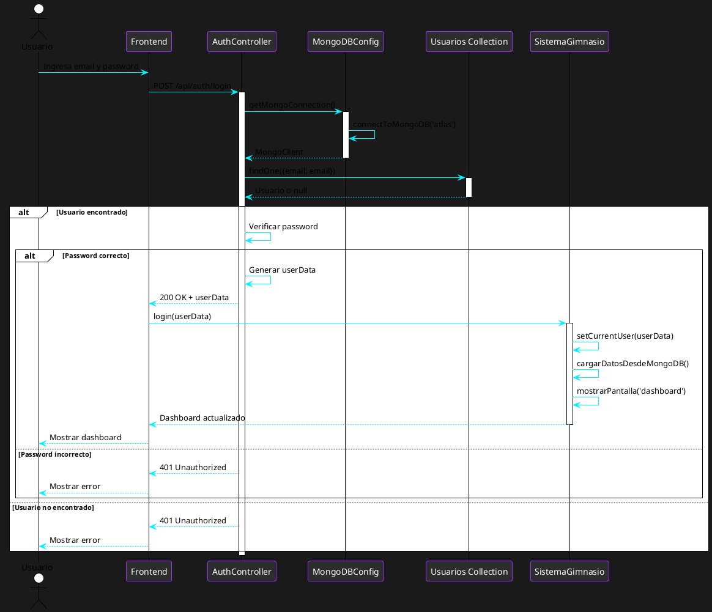
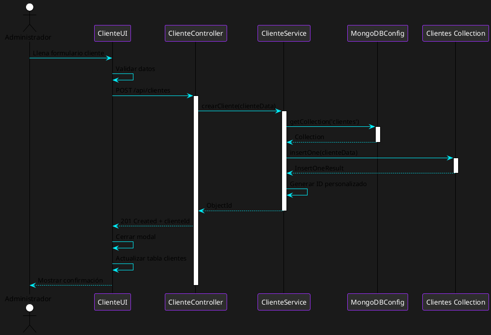
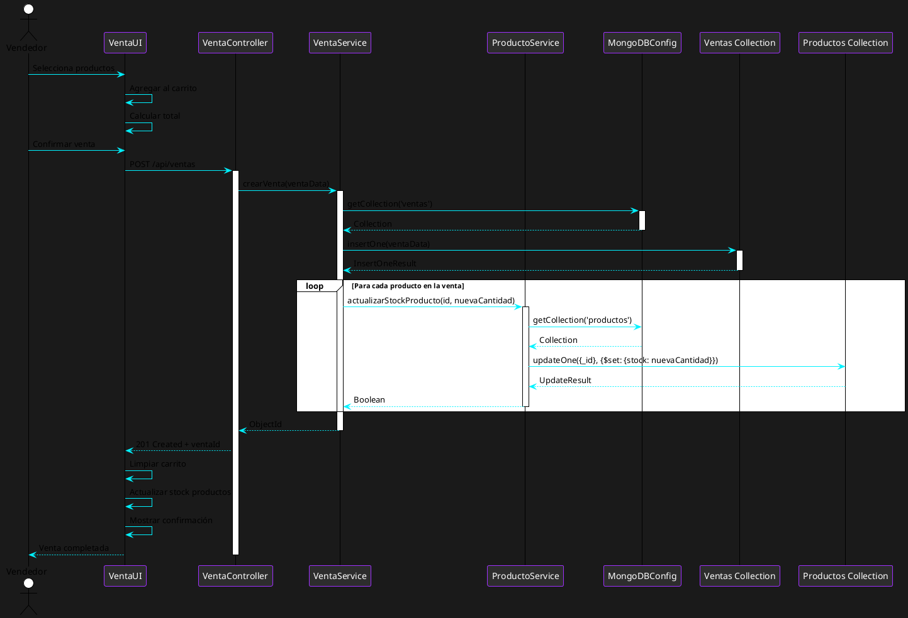
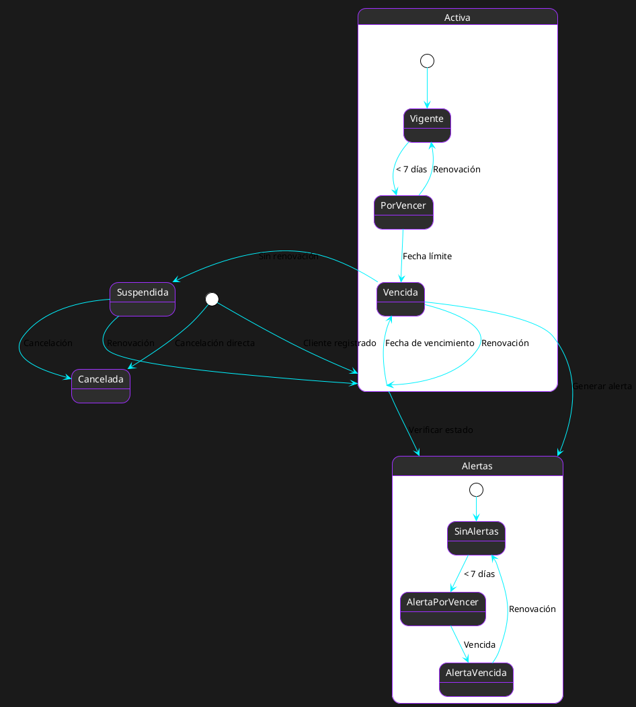
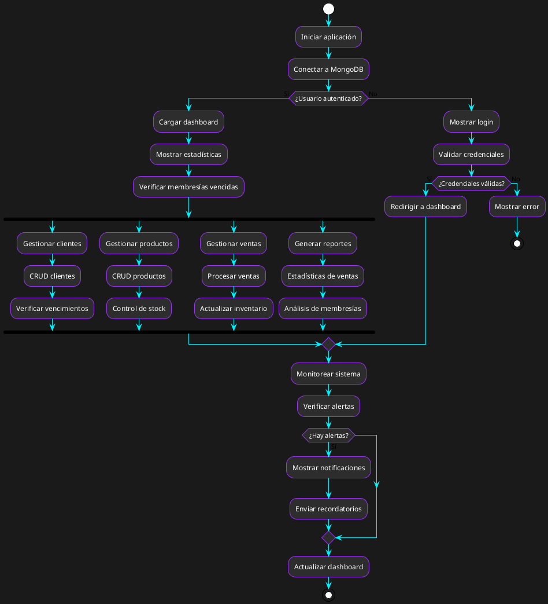
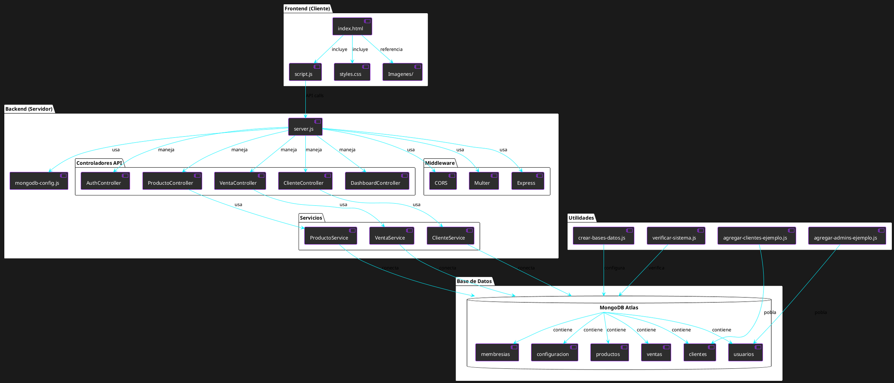
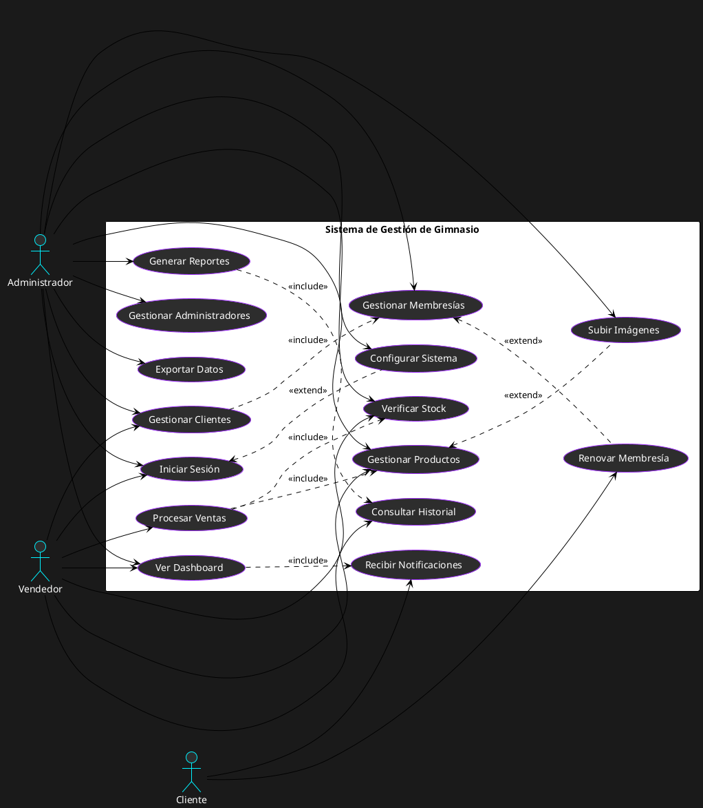
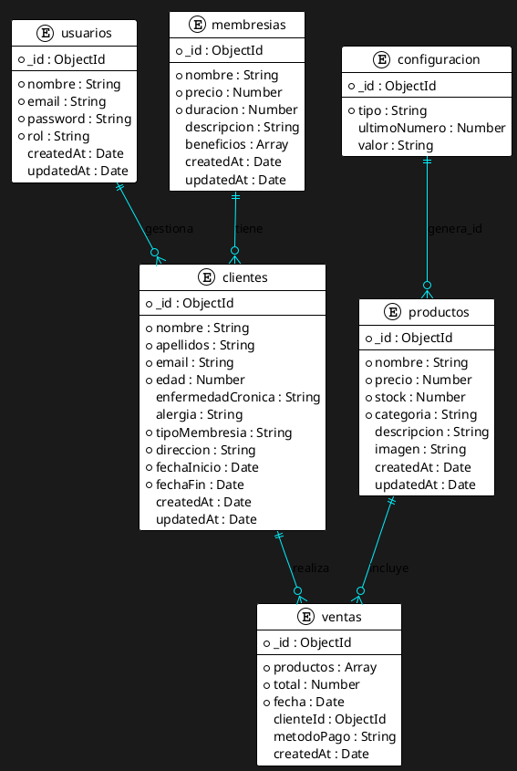

# Diagramas UML - Sistema de Gestión de Gimnasio

## 1. Diagrama de Clases (Class Diagram)

```plantuml
@startuml SistemaGimnasio_ClassDiagram

!theme plain
skinparam backgroundColor #ffffff
skinparam classBackgroundColor #2d2d2d
skinparam classBorderColor #9f2fff
skinparam classFontColor #ffffff
skinparam arrowColor #00f2ff

package "Entidades del Sistema" {
    class Usuario {
        -_id: ObjectId
        -nombre: String
        -email: String
        -password: String
        -rol: String
        -createdAt: Date
        -updatedAt: Date
        +login(email, password): Boolean
        +logout(): void
        +cambiarPassword(nuevaPassword): void
    }

    class Cliente {
        -_id: ObjectId
        -nombre: String
        -apellidos: String
        -email: String
        -edad: Number
        -enfermedadCronica: String
        -alergia: String
        -tipoMembresia: String
        -direccion: String
        -fechaInicio: Date
        -fechaFin: Date
        -createdAt: Date
        -updatedAt: Date
        +calcularDiasRestantes(): Number
        +renovarMembresia(tipo): void
        +verificarVencimiento(): Boolean
    }

    class Producto {
        -_id: ObjectId
        -nombre: String
        -precio: Number
        -stock: Number
        -categoria: String
        -descripcion: String
        -imagen: String
        -createdAt: Date
        -updatedAt: Date
        +actualizarStock(cantidad): void
        +verificarStockBajo(): Boolean
        +calcularValorTotal(): Number
    }

    class Venta {
        -_id: ObjectId
        -productos: Array
        -total: Number
        -fecha: Date
        -clienteId: ObjectId
        -metodoPago: String
        -createdAt: Date
        +calcularTotal(): Number
        +agregarProducto(producto, cantidad): void
        +aplicarDescuento(porcentaje): void
    }

    class Membresia {
        -_id: ObjectId
        -nombre: String
        -precio: Number
        -duracion: Number
        -descripcion: String
        -beneficios: Array
        -createdAt: Date
        -updatedAt: Date
        +calcularPrecioDescuento(descuento): Number
        +verificarDisponibilidad(): Boolean
    }

    class Configuracion {
        -_id: ObjectId
        -tipo: String
        -ultimoNumero: Number
        -valor: String
        +generarIdPersonalizado(): String
        +actualizarContador(): void
    }
}

package "Servicios de Base de Datos" {
    class MongoDBConfig {
        -client: MongoClient
        -config: Object
        +connectToMongoDB(environment): MongoClient
        +getDatabase(environment): Database
        +getCollection(collectionName, environment): Collection
        +closeConnection(): void
    }

    class ClienteService {
        +crearCliente(clienteData): ObjectId
        +obtenerClientes(): Array
        +obtenerClientePorId(id): Cliente
        +actualizarCliente(id, datos): Boolean
        +eliminarCliente(id): Boolean
        +buscarClientesPorNombre(nombre): Array
        +obtenerClientesMembresiaVencida(): Array
    }

    class ProductoService {
        +crearProducto(productoData): ObjectId
        +obtenerProductos(): Array
        +obtenerProductoPorId(id): Producto
        +actualizarProducto(id, datos): Boolean
        +eliminarProducto(id): Boolean
        +actualizarStockProducto(id, stock): Boolean
    }

    class VentaService {
        +crearVenta(ventaData): ObjectId
        +obtenerVentas(): Array
        +obtenerVentaPorId(id): Venta
        +obtenerVentasPorFecha(fechaInicio, fechaFin): Array
        +calcularEstadisticasVentas(): Object
    }
}

package "Controladores de API" {
    class AuthController {
        +login(req, res): void
        +logout(req, res): void
        +verificarToken(req, res): void
    }

    class ClienteController {
        +obtenerClientes(req, res): void
        +crearCliente(req, res): void
        +actualizarCliente(req, res): void
        +eliminarCliente(req, res): void
        +buscarClientes(req, res): void
    }

    class ProductoController {
        +obtenerProductos(req, res): void
        +crearProducto(req, res): void
        +actualizarProducto(req, res): void
        +eliminarProducto(req, res): void
        +subirImagen(req, res): void
    }

    class VentaController {
        +obtenerVentas(req, res): void
        +crearVenta(req, res): void
        +obtenerEstadisticas(req, res): void
        +obtenerVentasSemanales(req, res): void
    }

    class DashboardController {
        +obtenerEstadisticas(req, res): void
        +obtenerVentasSemanales(req, res): void
        +obtenerProductosStockBajo(req, res): void
    }
}

package "Frontend" {
    class SistemaGimnasio {
        -currentUser: Usuario
        -clientes: Array
        -productos: Array
        -ventas: Array
        -carrito: Array
        +login(email, password): void
        +logout(): void
        +cargarDatosDesdeMongoDB(): void
        +mostrarPantalla(pantalla): void
        +actualizarDashboard(): void
    }

    class DashboardUI {
        +renderizarEstadisticas(): void
        +renderizarGraficas(): void
        +actualizarNotificaciones(): void
        +mostrarAlertasMembresias(): void
    }

    class ClienteUI {
        +renderizarTablaClientes(): void
        +mostrarFormularioCliente(): void
        +editarCliente(id): void
        +eliminarCliente(id): void
        +buscarClientes(termino): void
    }

    class ProductoUI {
        +renderizarTablaProductos(): void
        +mostrarFormularioProducto(): void
        +editarProducto(id): void
        +eliminarProducto(id): void
        +renderizarGridProductos(): void
    }

    class VentaUI {
        +renderizarCarrito(): void
        +agregarAlCarrito(producto): void
        +removerDelCarrito(productoId): void
        +procesarVenta(): void
        +renderizarHistorialVentas(): void
    }
}

' Relaciones entre entidades
Usuario ||--o{ Cliente : "gestiona"
Cliente ||--o{ Venta : "realiza"
Producto ||--o{ Venta : "incluye"
Membresia ||--o{ Cliente : "tiene"

' Relaciones con servicios
MongoDBConfig ||--o{ ClienteService : "proporciona"
MongoDBConfig ||--o{ ProductoService : "proporciona"
MongoDBConfig ||--o{ VentaService : "proporciona"

' Relaciones con controladores
ClienteService ||--o{ ClienteController : "utiliza"
ProductoService ||--o{ ProductoController : "utiliza"
VentaService ||--o{ VentaController : "utiliza"

' Relaciones con frontend
SistemaGimnasio ||--o{ DashboardUI : "contiene"
SistemaGimnasio ||--o{ ClienteUI : "contiene"
SistemaGimnasio ||--o{ ProductoUI : "contiene"
SistemaGimnasio ||--o{ VentaUI : "contiene"

@enduml
```



## 2. Diagrama de Secuencia - Login de Usuario



## 3. Diagrama de Secuencia - Crear Cliente



## 4. Diagrama de Secuencia - Procesar Venta



## 5. Diagrama de Estados - Membresía de Cliente



## 6. Diagrama de Actividad - Flujo Principal del Sistema



## 7. Diagrama de Componentes - Arquitectura del Sistema



## 8. Diagrama de Casos de Uso



## 9. Diagrama de Entidad-Relación (ERD)



## 10. Diagrama de Despliegue

```plantuml
@startuml SistemaGimnasio_DeploymentDiagram

!theme plain
skinparam backgroundColor #1a1a1a
skinparam nodeBackgroundColor #2d2d2d
skinparam nodeBorderColor #9f2fff
skinparam nodeFontColor #ffffff
skinparam arrowColor #00f2ff

node "Cliente Web" {
    [Navegador Web] as Browser
    [HTML/CSS/JS] as Frontend
}

node "Servidor Web" {
    [Node.js Runtime] as NodeJS
    [Express.js] as Express
    [MongoDB Driver] as MongoDriver
    [Multer] as Multer
    [CORS] as CORS
}

node "Base de Datos" {
    database "MongoDB Atlas" as MongoDB {
        [gimnasio_db] as Database
    }
}

node "Almacenamiento" {
    [Sistema de Archivos] as FileSystem {
        [Imagenes/] as Images
        [Logs/] as Logs
    }
}

node "Red" {
    [Internet] as Internet
    [HTTPS] as HTTPS
}

' Conexiones
Browser --> Internet : HTTP/HTTPS
Internet --> Express : Puerto 3000
Express --> NodeJS : Ejecuta en
NodeJS --> MongoDriver : Usa
MongoDriver --> MongoDB : Conecta
Express --> Multer : Usa
Express --> CORS : Usa
Multer --> FileSystem : Guarda archivos
Express --> FileSystem : Lee archivos
MongoDB --> Database : Contiene
Database --> Images : Referencia
Database --> Logs : Genera

@enduml
```

## Instrucciones para usar estos diagramas:

1. **PlantUML Online**: Ve a [plantuml.com/plantuml](http://www.plantuml.com/plantuml) y pega cualquiera de los códigos anteriores.

2. **VS Code**: Instala la extensión "PlantUML" y crea archivos `.puml` con estos códigos.

3. **Draw.io**: Puedes importar los diagramas generados por PlantUML.

4. **Herramientas locales**: Instala PlantUML localmente para generar imágenes PNG, SVG o PDF.

Estos diagramas UML proporcionan una visión completa de la arquitectura, flujos de datos, relaciones entre entidades y casos de uso de tu sistema de gestión de gimnasio. 